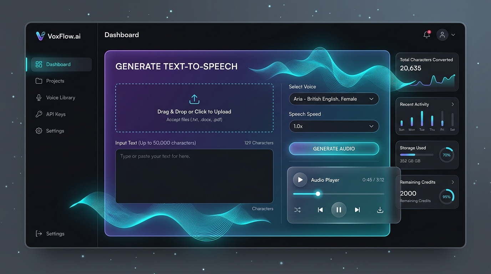

# VoxFlow.ai - Premium Neural Text-to-Speech & AI Media Studio

VoxFlow.ai is a state-of-the-art web application that synthesizes text and documents (.pdf, .txt) into highly realistic, human-like speech. Built on a robust Django backend, it features a premium glassmorphic dark user interface, user accounts with a personal conversion history dashboard, and advanced speech customization options.

This version has been upgraded to a comprehensive local AI Media Studio, supporting multi-language translation, webcam-based OCR text scanning, social authentication, audio-to-video generation, and local Stable Diffusion image styling.



---

## 🌟 Key Features

*   **Microsoft Edge Neural TTS Integration**: Uses advanced neural text-to-speech models to generate voices that sound natural, expressive, and indistinguishable from actual humans.
*   **Natural Emotional Expression**: Inflections and voice tones are determined automatically based on punctuation:
    *   **Exclamatory sentences (`!`)**: The AI raises its pitch and speaks with higher intensity.
    *   **Interrogative sentences (`?`)**: The AI raises its pitch at the end of the sentence.
    *   **Declarative sentences (`.`)**: Natural falling pitch cadence.
*   **Feature 1: Multi-Language Translation**:
    *   Translate input text into Spanish, French, German, Hindi, or English before conversion.
    *   Uses `argos-translate` (local/offline) as the primary engine, `langdetect` for auto-detecting source language, and `deep-translator` as fallback.
    *   Interactive side-by-side translation preview step before generating audio.
*   **Feature 2: Camera & Upload OCR Text Detection**:
    *   Extract text from uploaded photos or local camera streams.
    *   Powered by local `easyocr` and OpenCV frame preprocessing (denoising, adaptive thresholding).
    *   Features an interactive webcam scanning viewfinder overlays with real-time text bounding boxes.
*   **Feature 3: Social Login Integration**:
    *   Enables standard sign-in alongside Google OAuth login via `django-allauth`.
    *   Supports automatic account merging for matching emails.
*   **Feature 4: Audio-to-Video Generator**:
    *   Renders speech audio into shareable MP4 videos.
    *   Supports animated waveform visualizers and auto-generated captions, transcribed locally via `openai-whisper` and drawn onto the video with `moviepy`.
*   **Feature 5 & 6: Stable Diffusion Image Studio**:
    *   Generate images from text prompts locally using `stabilityai/sd-turbo` (runs in 1-4 steps!).
    *   Features style presets (realistic, anime, watercolor, pixel art).
    *   Includes an HTML5 canvas brush editor to draw masks and inpaint/edit details of uploaded pictures.
*   **Local Background Job Queue**:
    *   Utilizes `django-q2` database (ORM) broker. Spawns tasks (stable diffusion generation, moviepy video rendering) asynchronously to prevent frontend HTTP timeouts.

---

## 🛠️ Tech Stack

*   **Backend**: Django 5.0 (Python 3.11)
*   **Background Worker**: `django-q2` (Database/ORM broker)
*   **Neural TTS**: `edge-tts` (Microsoft Edge Neural TTS engine)
*   **OCR Scanning**: `opencv-python-headless`, `easyocr`, `numpy`
*   **Translation**: `argostranslate`, `langdetect`, `deep-translator`
*   **Audio-to-Video**: `moviepy`, `openai-whisper`
*   **Stable Diffusion**: Hugging Face `diffusers`, `transformers`, `accelerate`, `torch`, `torchvision`
*   **Social Authentication**: `django-allauth`
*   **Database**: SQLite

---

## 🚀 Installation & Local Setup

Make sure you have Python 3.11+ installed.

### 1. Clone & Navigate
```bash
git clone https://github.com/NawinSRIvatsav/TEXT_To_AUDIO.git
cd TEXT_To_AUDIO
```

### 2. Install Dependencies
```bash
pip install -r requirements.txt
```
*(Optional: If running on a GPU-enabled machine, make sure PyTorch is configured with CUDA for faster Stable Diffusion and Whisper inference).*

### 3. Apply Database Migrations
Create and migrate database models to construct the schema:
```bash
python manage.py makemigrations
python manage.py migrate
```

### 4. Create a Superuser
```bash
python manage.py createsuperuser
```

### 5. Launch the Services
To run the full application locally, you must launch two processes:

#### Process A: Start the Web Server
```bash
python manage.py runserver
```

#### Process B: Start the Background Task Worker
```bash
python manage.py qcluster
```
*The background task worker processes Stable Diffusion requests and MoviePy video rendering asynchronously.*

Visit `http://127.0.0.1:8000/` in your web browser to access the app.

---

## 🧪 Running Automated Tests

Run the Django unit test suite to verify all model assertions, form validations, and view endpoints:
```bash
python manage.py test
```

---

## 📂 Project Structure

```text
├── assets/                  # Project assets (Mockups, Logos)
│   └── voxflow_ui_mockup.jpg
├── config/                  # Django project configuration
│   ├── settings.py          # App settings (social auth, Q_CLUSTER)
│   ├── urls.py
│   └── wsgi.py
├── converter/               # Core text-to-speech app
│   ├── migrations/
│   ├── services/            # Core AI services
│   │   ├── ocr.py           # OpenCV & EasyOCR extraction rules
│   │   ├── translation.py   # Multi-language translation engine
│   │   ├── video.py         # Waveform visualizer & Whisper subtitles
│   │   └── image_gen.py     # Stable Diffusion txt2img, img2img, & inpainting
│   ├── models.py            # AudioConversion, GeneratedImage schemas
│   ├── signals.py           # Post-delete cleanups of files from disk
│   ├── tasks.py             # Background tasks worker definitions
│   ├── views.py             # App endpoint handlers
│   ├── forms.py             # Selector and toggles forms
│   └── tests.py             # View and form unit test suite
├── static/                  # Static resources
│   ├── css/
│   │   └── style.css        # Premium dark glassmorphic styling
│   └── js/
│       └── main.js          # File dropzones & audio player controls
├── templates/               # HTML Templates
│   ├── base.html            # Global navbar & footer
│   ├── converter/
│   │   ├── convert.html     # TTS form, translation, and options
│   │   ├── dashboard.html   # User conversions, video link downloads
│   │   ├── scan.html        # Camera OCR scanner with viewfinder
│   │   └── image_gen.html   # Stable Diffusion text-to-image studio & canvas masking
│   └── registration/
│       ├── login.html       # Sign-in panel with Google OAuth
│       └── signup.html      # Account signup with Google OAuth
├── requirements.txt         # Project package requirements
└── manage.py                # Django entry point
```

---

## 📄 License
This project is open-source and available under the [MIT License](LICENSE).
